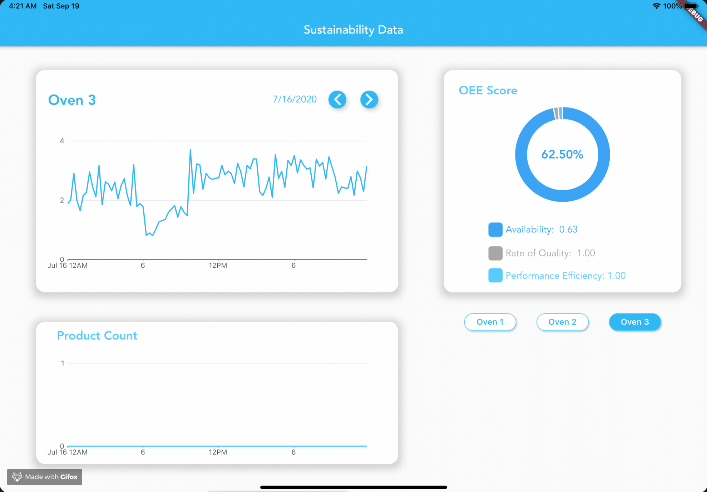
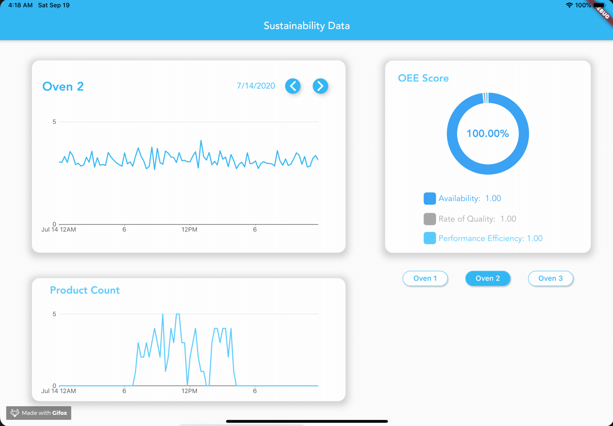

# Factory Oven Production Data Analysis App

Sustainability usecase solution application for Rockwell Automation's 24toCode hackathon. Using this app you are able to see a visualization oven data for one of Rockwell's plants by day.  Using the date change buttons, the user can see oven data for that day.

***Note:** The csv data files used in the are not shared here.* 

## Widgets

The 3 featured widgets are the Oven Energy Graph, the OEE Score widget, and the Oven Product Count Graph. These widgets are controlled using Flutter's state management package *providers*. These widgets are "listeners", or consumers, to the providers, the date changer widget and the oven selector widget. Then the change notifier, Oven, is used to pass data from the provider widgets to the consumer widgets and notifies these widgets when a change is made.

### Oven Selector Widget

Using the oven buttons, the user can switch between the plant's 3 ovens' data.

 

  

### Date Changer Widget

Using the date change buttons, the user can see oven data for that day.

 

  

## Flutter Packages Used

* charts_flutter
* provider
* cupertino_icons
